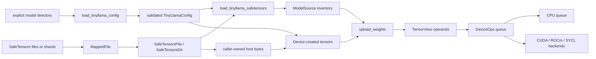

# IOM architecture

IOM is an inference-only C++20 engine for sparse, oversized language models. It
executes operations imperatively: there is no computation graph and no autograd
system. Callers create the storage and output tensors that an operation will
use, then submit work to a device queue. This keeps allocation, placement, and
lifetime decisions explicit—important when model weights can live across disk,
host RAM, and accelerator memory.

## System shape



The public API is split between backend-neutral headers in `include/iom` and
small backend factory headers in `include/iom/{cpu,cuda,rocm,sycl}`.
`libiom` contains the neutral tensor, allocation, mapped-file, SafeTensors,
model-configuration/model-source, and CPU implementation. Each optional
accelerator builds as a separate static library and links to `libiom`:

| Backend | Build option and library | Runtime/storage model |
| --- | --- | --- |
| CPU | always in `libiom` | Reference device, caller-supplied storage, standard tiled encoding. |
| CUDA | `CUDA_ENABLED`, `iom_cuda` | One owned CUDA driver context per device; caller supplies unmanaged native device storage for that context. |
| ROCm | `ROCM_ENABLED`, `iom_rocm` | One owned HIP context per device; caller supplies native storage for that ordinal. |
| SYCL | `SYCL_ENABLED`, `iom_sycl` | One owned SYCL context for an eligible accelerator ordinal; caller supplies the allocator. |

Common code deliberately knows no runtime-specific type, active-backend global,
or backend-kind switch. A `Device` is a backend-neutral interface, and every
backend exports a factory returning `std::unique_ptr<Device>`. The concrete
device creates its tensors and its operation queues. Consequently, two devices
can coexist without a process-wide selection step.

### Layers and responsibilities

1. **Data and model ingestion.** `load_tinyllama_config` validates the explicit
   model directory's `config.json` and returns the runtime dimensions before
   any mapping, allocation, or device work. `load_tinyllama_safetensors` then
   validates the complete required SafeTensors role inventory of the same
   directory, publishes it as an immutable `ModelSource`, and privately retains
   one owning mapping store plus one borrowed mapped payload span per published
   entry for its lifetime. `MappedFile` owns a read-only
   mapping. `SafeTensorsFile` parses one mapping, while `SafeTensorsDir` owns
   the shard files for a directory. Both return non-owning `SafeTensorView`
   objects over those mapped bytes.
2. **Core tensor contract.** `TensorSpec`, `Tensor`, and `TensorView` define
   logical shape, element encoding, quantization declaration, tiled layout, and
   view transformations. The core owns metadata only; actual storage belongs to
   the creating backend.
3. **Device and storage boundary.** `Device` validates the requested spec
   against backend capabilities and creates a materialized `Tensor`. CPU,
   CUDA, ROCm, and SYCL use the common standard layout while preserving the
   same public tensor contract.
4. **Execution boundary.** `DeviceOps` is an in-order asynchronous queue over
   caller-created views. `copy` and the four binary operations are the shipped
   compute operations:
   `add`, `mul`, `sub`, and `div` each have the exact common signature
   `oid op(const TensorView&, const TensorView&, TensorView&) noexcept`.
   Accepted work returns a positive OID; rejected work returns a negative
   `OidError`. Other compute methods remain unsupported and never silently
   fall back or allocate.
5. **Backend runtime implementation.** Backends turn a validated operation
   into synchronous host transfer, CPU work, or runtime stream submission. CUDA
   and ROCm share policy-templated queue, completion, staging, and copy
   machinery; their policy isolates driver/HIP primitives and diagnostics.

### Data flow and allocation policy

A typical weight path is:

1. Validate `<model_directory>/config.json` with `load_tinyllama_config`; a
   rejected configuration stops the path before any mapping or allocation.
2. Validate the complete required weight inventory with
   `load_tinyllama_safetensors`, which opens and retains exactly one owning
   `SafeTensorsFile`/`SafeTensorsDir` and publishes the `ModelSource`
   inventory. A missing, wrong, or obviously incomplete checkpoint is rejected
   here before any device, tensor, or workspace exists.
3. Look up a named `SafeTensorView` in the retained store; its raw bytes remain
   borrowed from the store's mapping. `ModelSource::tensor_spec` exposes the
   published logical metadata, never host bytes.
4. Construct a backend device and create one destination `Tensor` per
   published inventory entry from a validated `TensorSpec`.
5. Preflight the complete ordered destination binding with
   `ModelSource::upload_workspace_requirements`; it validates the whole list
   before querying any owner and reports the maximum serial `copy_from_host`
   requirement of the binding. The caller provisions that reusable scratch only
   after this query, and only then transfers.
6. Realize the published source with
   `ModelSource::upload_weights(device, destinations, workspace)`: it validates
   the same complete binding and the supplied scratch before the first copy and
   then copies each mapped BF16 payload directly into its destination full view
   in inventory order. Its normal `void` return is the only publication
   permission, so the caller exposes a usable model only after it returned.
7. Copy host bytes into the tensor view, or schedule a `DeviceOps::copy` between
   compatible device views.
8. Submit compute with explicit input and output views. Operations do not
   allocate operands or outputs; the caller owns their capacity and placement.
9. Wait for the returned operation token before consuming an asynchronous
   result, destroying an owner, or violating the host-transfer synchronization
   rules below.

This flow intentionally preserves a direct mapped-file -> SafeTensors ->
caller-created tensor -> queued-operation pipeline. IOM does not introduce a
central weight cache, active-device registry, or hidden output allocation.

## Memory ownership and conformance accounting

Standard-GPU devices (CUDA, ROCm, and SYCL) reserve exactly two IOM-native
backing allocations during factory setup: one **tensor-data backing** of the
caller-selected `DeviceMemoryConfig::tensor_arena_bytes`, and one separate
**metadata backing** of checked capacity `4 * C * 512` bytes, where `C` is the
immutable `QueueConfig::max_in_flight_per_queue`. The data backing is managed
by one device-owned, synchronized `ListAllocator`; tensors and explicit
`RawWorkspace` owners receive stable arena subranges. The metadata backing is
managed by one device-wide `FixedSizeAllocator` with 32-byte alignment,
512-byte payload/stride, and exactly `4 * C` slots. Metadata descriptors lease
those fixed slots; they never address tensor-data ranges.

An accepted request has a host snapshot and a token history. A dispatched
request additionally owns one native in-flight credit, one completion resource,
and (when its descriptor requires it) one metadata-slot lease. A request that
is waiting for a credit is **host parked**: it holds no native credit, metadata
slot, completion resource, or native allocation, and the queue dispatches
parked requests strictly FIFO. A completion resource, descriptor lease, data
subrange, and caller workspace range become reusable only after completion is
proved. Unknown native use retains the complete unresolved lease in
device-owned quarantine; a queue or another device cannot make that range
available by destruction or an unrelated drain.

After successful standard-GPU setup, tensor/workspace creation and destruction,
view transforms, transfers, submissions, waits, retirement, queue recreation,
parking, and failure recovery issue zero additional IOM-native device
allocation/free calls and do not resize resource arrays. This guarantee is
about calls made by IOM at the backend allocation boundary.
Vendor/SDK allocations (including SYCL event internals and other runtime
behavior) are a separate, potentially unavailable evidence category and are
never relabeled as IOM calls. Host allocations for snapshots, fixed mirrors,
staging, and caller-owned workspaces are likewise distinct from native backing
allocation.

CPU intentionally retains borrowed caller allocator ownership and host/reference
storage; it has no device metadata arena or fabricated native slots. The
retained accelerator backends report vendor-internal allocation behavior as
unproven whenever the runtime does not expose a comparable observation
boundary.

The conformance layer under `test/backend` owns backend-neutral requirement,
rank, queue, workspace, lifetime, and FIFO observations. Backend drivers own
factory setup, native allocation/free instrumentation, hardware context
construction, and independent physical-storage oracles. This repository has no
`examples/` directory; factory/tool caller audits therefore cover the
available source and test callers without inventing an example.

Two-GPU/eight-GPU isolation and first-use/warmed performance comparisons are
environment-dependent evidence, not universal passes. They are recorded only
when matching hardware and a matching pre-change baseline exist; otherwise the
topology or baseline is an explicitly reported non-universal risk. Serialized
host-transfer throughput is reported separately from compute throughput.

## Tensor representation


### Specification and logical values

A `TensorSpec` contains:

- a `TensorShape`—an owned vector of logical dimensions;
- a leaf `DataType`, covering boolean, signed/unsigned 2- through 64-bit
  integers, several low-precision floating encodings, and F16/BF16/F32/F64;
- a `QuantizationFormat`, defaulting to `NONE` and enumerating generic,
  OCP, NVIDIA, GGML, and `TT_BFP*` formats.

`TensorShape` requires rank two or greater and nonzero dimensions.
`TensorShape::element_count`, `TensorSpec::logical_nbytes`,
`standard_padded_shape`, and `tiled_storage_nbytes` are checked size
calculations. `TensorSpec::validate()` is the gate before storage or work: it
rejects unknown leaf encodings and every quantization value other than the
currently implemented `NONE`, as well as invalid shapes and arithmetic
A device also exposes the exact unquantized leaf types it accepts through
`supported_data_types()`; `create_tensor` rejects unsupported specifications
rather than converting them.

The standard-layout backends—CPU, CUDA, ROCm, and SYCL—share one immutable set
of 23 unquantized leaf encodings. ADD, MUL, and SUB require, with
`QuantizationFormat::NONE`, exactly these 21 numeric leaves on every backend:
`I2`, `U2`, `I4`, `U4`, `I8`, `U8`, `I16`, `U16`, `I32`, `U32`, `I64`, `U64`,
`F4_E2M1`, `F6_E2M3`, `F6_E3M2`, `F8_E4M3FN`, `F8_E5M2`, `F16`, `BF16`, `F32`,
and `F64`. DIV accepts exactly the nine floating leaves
`F4_E2M1`, `F6_E2M3`, `F6_E3M2`, `F8_E4M3FN`, `F8_E5M2`, `F16`, `BF16`, `F32`,
and `F64`. Matching `BOOL`, `F8_E8M0`, non-`NONE` quantization, or integer DIV
is `Unsupported` after all earlier validation. Required leaves are not limited
by SDK native dtype support: staging or emulation is internal, and the public
tensor contract remains unchanged for every retained backend.

### Standard 16x16 tiled layout

The final two logical dimensions form a matrix and use fixed `16 x 16` tiles.
They are padded to tile boundaries for storage. Leading dimensions select matrix
planes and are row-major. The conceptual standard-layout order is:

```text
leading plane (row-major)
  -> tile row
    -> tile column
      -> row within 16x16 tile
        -> column within 16x16 tile
```

The exact standard slot helpers use checked coordinates and this order. This is
the physical layout used by CPU, CUDA, ROCm, and SYCL and is the common format
for their transfer/copy machinery. It is designed for tile-oriented matrix
hardware without making that runtime detail part of the public interface.

For standard-layout host transfers, logical elements are bit-packed
least-significant-bit first at the exact `DataType` width; multi-byte fields
are little-endian. The transfer implementation scatters that row-major logical
bit stream into tiles on upload and gathers it on download, leaving tile padding
outside the logical byte payload. Boolean host bytes are constrained to `0` or
`1`.

Metadata stays on the host. A tensor's native storage handle is owned by the
backend and may be host memory or device memory; callers must not infer the
layout from that opaque handle. Logical byte counts describe host transfer
payloads, whereas tiled storage counts include the standard layout's padding.

### Owners, views, and transforms

`Tensor` is the materialized owner produced only by `Device::create_tensor`.
It owns one stable full-storage `TensorView`; it is non-copyable and
non-movable. The creating `Device` must outlive it. A device's borrowed
allocator must likewise outlive that device and every tensor and queue created
from it. The base-address contract for allocator-backed tensors is 32-byte
alignment.

`TensorView` is a copyable, non-owning window into exactly one `Tensor` owner.
It contains a spec, a plane offset, and plane strides measured in **whole
logical planes**, never bytes or elements. It is deliberately not assignable:
a view cannot later be retargeted. Its `native_handle()` always denotes the
owner storage and is never a retained ownership handle.

Only leading dimensions are transformable:

- `slice(dim, first, count, step)` selects a strided leading range;
- `select(dim, index)` removes one leading dimension at an index;
- `permute(leading_order)` reorders leading dimensions;
- `reshape_leading(leading_dimensions)` changes only the leading logical shape.

The final two tiled dimensions cannot be sliced, selected, permuted, or
reshaped. Transformations preserve the same owner and must remain within its
logical plane address space; shape, rank, permutation, extent, and stride
arithmetic are validated before producing the new view. No transform relocates
storage.

### Transfer and lifetime rules

`TensorView::copy_from_host` and `copy_to_host` are synchronous transfers of
exactly `spec().logical_nbytes()`; a mismatched host buffer is invalid. They do
not wait for `DeviceOps` queues:

- wait for outstanding writes before reading the tensor from the host;
- wait for every outstanding read **and** write before overwriting it from the
  host or destroying its owner;
- retain all tensor owners until queued work using their storage has completed.
  Queues must snapshot any view metadata needed at submission: derived
  `TensorView` temporaries may be destroyed before `wait`.
Queue copies validate that both views belong to the queue's device and have the
same spec. Every binary operation snapshots an immutable backend-neutral request
for all three views, including owner/device identities, handles, exact specs,
offsets, strides, and result-aligned broadcast mapping.

Validation precedes effects, owner registration, token acceptance, and backend
work: recognized specs/rank/dim/device/owner/handle/view/storage and checked
arithmetic; identical leaf and quantization; right-aligned broadcasting and
output shape; mapping snapshot; exact alias rule; then operation support.
Malformed or mismatched input maps to `InvalidArgument`, checked arithmetic to
`Overflow`, bounded pre-acceptance resources to `ResourceExhausted`, runtime
failure before acceptance to `DeviceError`, and other failures to
`InternalError`; unsupported matching domains map to `Unsupported`.

Ranks below two are invalid. `[1,1]` is the scalar convention and broadcasts
over every output axis; two such operands produce `[1,1]`. Otherwise ranks are
right-aligned with conceptual leading ones, axes must match or be one, and
`out` must have exactly the maximum shape. Singleton coordinates—including
tiled tails—map to zero before tile-slot mapping; padding is never read and
broadcast materialization is internal, never a public zero-stride view.
Transformed leading views retain independent offsets and plane strides.

All four operations require the same leaf and quantization in all three views.
ADD, MUL, and SUB support the 21 NONE numeric leaves listed above; DIV supports
only the nine NONE floating leaves. BOOL, F8_E8M0, non-NONE quantization, and
integer DIV are unsupported only after the preceding checks. No promotion,
public query, fallback selector, or SDK dtype narrowing exists.

Same-owner exact in-place alias is allowed only for identical spec, plane offset,
plane strides, and logical mapping; reject all other input/output relationships,
including disjoint or broadcast windows. Read/read overlap is valid. Capture
both input values before each output store, track all three owners through
completion, deduplicate exact aliases, and retain metadata snapshots rather than
caller view objects.

For width `w`, integer MUL and SUB return the low `w` bits of the exact product
or difference modulo `2^w`, without signed-overflow UB; DIV is not integer.
Floating values decode by named format, compute in the extended mathematical or
IEEE domain, and encode once with RNE (no intermediate destination rounding).
Gradual underflow and no FTZ/DAZ are required. MUL zero×infinity and any NaN
are NaN; SUB same-sign infinities and any NaN are NaN; DIV NaN, 0/0, and
infinity/infinity are NaN, with signed zero/infinity outcomes by operand signs.
F4/F6 saturate finite overflow/infinity and encode NaN as their canonical
maximum; E4M3FN saturates infinity/overflow and has a NaN class; E5M2, F16,
BF16, F32, and F64 preserve infinity/NaN classes. Finite results use the
reference encoding or an adjacent finite encoding within one ULP; operand
order is observable (`sub` is lhs-rhs, `div` is lhs/rhs).

ADD, MUL, SUB, and DIV are in-order asynchronous work (CPU may complete inline)
with repeatable waits. Invalid negative, zero, foreign, future, skipped, or
unsubmitted values are rejected by `wait`; accepted failures remain and are
re-thrown on every later wait. Pre-submit failures return a negative OID, do not
mutate output, and consume no token; partial output after accepted failure is
unspecified. Operations allocate neither operands nor results and never replace
or relocate caller storage, owners, or native handles. Internal staging,
conversion, workspace, and emulation are permitted, and accepted failures are
not retried. This additive SUB/DIV API and MUL behavioral cutover require
rebuilding consumers; no mixed-version ABI is promised.

## Planned TinyLlama single-sequence model flow

TinyLlama composition is a parameterized, imperative sequence of caller-owned
operations; it is not a graph, fused decoder kernel, or currently shipped
model API. Embedding, linear, RoPE, cache append, and SiLU retain their own
planned or port-specific status. RMSNorm and causal GQA SDPA are the closed
operation boundaries for this revision: each has a frozen API, an independent
reference, and four-backend conformance recorded in the backend contract and
published below. Existing `add` and `mul` provide the two residual
additions and the SwiGLU product without changing their contracts.

### Runtime dimensions and loading boundary

Runtime configuration and loaded parameter shapes determine:

| Symbol | Meaning |
| --- | --- |
| `Nlayers` | Number of configured decoder layers. |
| `R` | Exact logical rows in the current prefill or decode run. |
| `F` | Hidden width, constrained by the checked equality `F = Hq * D`. |
| `M` | MLP intermediate width. |
| `Hq` / `Hkv` | Query-head and key/value-head counts. |
| `D` | Per-head width. |
| `V` | Vocabulary size. |
| `C` | Bounded context and per-layer K/V cache capacity. |
| `Qcap` | Independent queue admission capacity; it does not size context or cache storage. |
Layer count, current absolute position/cache length, epsilon, and RoPE
parameters are likewise configuration. They are not inferred from one
checkpoint's constants. `load_tinyllama_config` reads `Nlayers`, `F`, `M`,
`Hq`, `Hkv`, `V`, and `C` from the explicit model directory's `config.json`
and derives the checked `D = F / Hq`: a missing or unreadable file is an I/O
failure, and an unsupported field, value, head ratio, or token policy is
rejected before any mapping, device, workspace, or weight work.
`load_tinyllama_safetensors` then validates the complete required role
inventory of that same directory and owns the mapped source behind the
published `ModelSource`, whose selected metadata carries the logical identity
and shape of every required weight.
Only the loader adapts checkpoint normalization vectors from `[H]` to `[1,H]`,
and it does so in logical metadata alone: the mapped span of every required
weight stays exactly `2 * product(source shape)` bytes, so no rank-one
`TensorShape`, final-axis view, transpose, or host repack is exposed. RMSNorm
remains rank 2 through 8 and never gains rank-one input or implicit
hidden-state broadcasting. Persistent checkpoint weights are not copied into a
second session-owned weight bank, and no persistent whole-checkpoint host copy
exists.

Realization of that published source has one fixed order. The caller creates
one destination owner per entry on its chosen device, then preflights the
complete ordered binding with `ModelSource::upload_workspace_requirements`,
which validates every destination — position, exact `Device` instance, BF16
capability, and the full selected specification — before it queries any owner
and returns the maximum serial `copy_from_host` requirement of the binding.
Only after that query does the caller provision the reusable scratch range, and
only then does it realize the weights with
`ModelSource::upload_weights(device, destinations, workspace)`, so no workspace
is allocated for an unvalidated or incomplete binding and none is sized by a
guess. The realization validates the same complete binding and the supplied
scratch before the first copy, copies each mapped BF16 payload directly into its
destination full owner view in inventory order, and returns `void`: that normal
return is the only publication permission, never a ready wrapper or a returned
readiness object. A later synchronous upload failure propagates its original
category, stops immediately, leaves earlier destinations with their copied bytes
and later ones untouched under unchanged caller ownership, and promises neither
rollback nor retry, so an interrupted session setup publishes no usable model.

This flow describes one sequence session, not request batching or serving.
Leading planes supported by individual operations remain independent logical
planes: no hidden state, normalization reduction, cache row, or workspace is
broadcast between them. A normal single-session spelling below omits a leading
plane index.

**Opt-in real-checkpoint loading verification.** The production API above is
unchanged, and one explicit verification path loads a caller-selected official
checkpoint on a selected device. `cmake -DIOM_TEST_REAL_MODEL_LOADING=ON`
compiles one additional case into each existing backend conformance executable,
which reads the explicit `IOM_TEST_MODEL_DIR` and pinned `IOM_TEST_MODEL_ID`
(plus `IOM_TEST_MODEL_ARENA_BYTES` on standard GPUs), validates the pinned
`N=22, H=2048, I=5632, Hq=32, Hkv=4, D=64, V=32000, C=2048` inventory, and
realizes all 201 BF16 roles through the fixed upload order above on the
driver's selected device alone. The option is `OFF` by default: the ordinary
configuration reads no model directory, assumes no default path, downloads
nothing, and creates no second full-weight reference binding. Nothing in this
path produces logits, tokens, generation, or performance evidence. See
**Model loading and weight layout** in `docs/BACKEND_CONTRACT.md` for the exact
environment contract, failure policy, and per-backend invocation.

### Forward sequence

Input token indices `[1,R]` are embedded once into the first BF16 residual
`X [R,F]`. For every configured decoder layer, in order:

1. **Attention normalization.** RMSNorm stores `N [R,F]` from `X` and that
   layer's `[1,F]` attention-normalization scale.
2. **Q/K/V projections.** Three distinct head-planar linears consume `N` and
   store Q `[Hq,R,D]`, K `[Hkv,R,D]`, and V `[Hkv,R,D]`.
3. **Positions.** Independent RoPE operations store rotated Q and K results;
   neither operation modifies or aliases its input.
4. **Caches.** Separate cache-append calls write the rotated K rows and V rows
   into that layer's distinct bounded K and V cache owners. Initialized cache
   length and capacity are explicit session state.
5. **Attention.** Causal grouped-query SDPA reads rotated Q and only the
   initialized, causally permitted K/V cache rows. It stores merged attention
   `A [R,Hq*D]`, which is `[R,F]` because `F=Hq*D`.
6. **Attention projection and first residual.** An ordinary output linear
   stores `B [R,F]`. Existing `add(X,B,X2)` then stores the first residual
   `X2 [R,F]`.
7. **MLP normalization and projections.** RMSNorm stores `N2 [R,F]` from
   `X2` and the layer's `[1,F]` post-attention scale. Separate ordinary
   linears store `Gate [R,M]` and `Up [R,M]`.
8. **SwiGLU and down projection.** SiLU stores `ActivatedGate [R,M]`.
   Existing `mul(ActivatedGate,Up,Product)` stores `Product [R,M]` in exactly
   that operand order; there is no fused SiLU-times-multiply operation. The
   down linear stores `Down [R,F]`.
9. **Second residual.** Existing `add(X2,Down,NextX)` stores the second
   residual. `NextX [R,F]` becomes the following layer's `X`.

After all configured layers, final RMSNorm stores `FinalN [R,F]` using the
loaded final `[1,F]` scale. The untied LM-head weights are a distinct
`[V,F]` parameter. An ordinary linear selects the final logical input row
through its row-window arguments and stores logits `[1,V]`. It does not make a
final-axis `TensorView` slice, compute logits for omitted rows, or reuse the
embedding table as a tied head.

Each listed operation produces a distinct logical BF16 store before its
consumer begins. BF16 arithmetic operations round at every operation boundary:
projection outputs, each normalization, Q/K RoPE, SDPA output, both residuals,
SiLU, the existing multiply, down projection, final normalization, and logits.
Embedding and cache append preserve BF16 payload bits at their own stores.
No fusion may erase residual/normalization or SiLU/multiply rounding
boundaries. Q, K, V, rotated Q/K, `A`, `B`, `X2`, `N2`, `Gate`, `Up`,
`ActivatedGate`, `Product`, `Down`, `NextX`, `FinalN`, and logits name
different produced values; a neural output is disjoint from inputs and
scratch. These names do not require a persistent activation-bank allocation
for every layer. A physical bank may be reused only after every reader and
accepted queue operation that references it has completed.

### Worked shape propagation

For `F=8`, `M=12`, `Hq=4`, `Hkv=2`, and `D=2`, the consumer shapes for all
four required run lengths are:

| `R` | Hidden/norm/residual | Q | K and V | Merged attention | Gate/up/SiLU/product | Final logits |
| ---: | --- | --- | --- | --- | --- | --- |
| 1 | `[1,8]` | `[4,1,2]` | `[2,1,2]` | `[1,8]` | `[1,12]` | `[1,V]` |
| 15 | `[15,8]` | `[4,15,2]` | `[2,15,2]` | `[15,8]` | `[15,12]` | `[1,V]` |
| 16 | `[16,8]` | `[4,16,2]` | `[2,16,2]` | `[16,8]` | `[16,12]` | `[1,V]` |
| 17 | `[17,8]` | `[4,17,2]` | `[2,17,2]` | `[17,8]` | `[17,12]` | `[1,V]` |

In every row, attention output projection consumes `[R,8]`, both residuals
consume matching `[R,8]` operands, the MLP down projection consumes `[R,12]`,
and the final normalization consumes the last `[R,8]` result. Logical
`R=15` and `R=17` do not expose or compute padded rows. `F=8`, `M=12`, and
`D=2` are non-tile widths whose padding never enters a reduction or consumer
shape. A conformance fixture with leading extent `P` independently maps
hidden `[P,R,8]` to Q `[P,4,R,2]`, K/V `[P,2,R,2]`, merged attention
`[P,R,8]`, and MLP intermediates `[P,R,12]`; no plane supplies another
plane's norm or cache. Neither that fixture nor final-row selection slices,
selects, permutes, or reshapes either final tensor axis.

### Setup, scheduling, and delivery

Setup has two allocation stages. Every `Nlayers,F,M,Hq,Hkv,D,V,C,R` value
used by a stage is nonzero, `F=Hq*D` is checked rather than assumed, and
`Qcap` is the separately configured nonzero queue admission bound. `C` limits
logical model positions and K/V rows; `Qcap` only limits accepted in-flight
work and never multiplies a tensor, cache, or activation-bank allocation.
Every shape, inserted or leading axis, and transformed view remains within the
standard rank interval 2 through 8.

#### Session setup and persistent storage

Session setup occurs before any request. It validates the configuration and
loaded shapes, establishes the mapped-weight ownership flow, creates all
persistent BF16 weight tensors on the caller-selected device, and allocates
bounded per-layer caches and fixed logical-run-one decode banks. Those owners
remain at stable addresses and are not recreated merely because a later prompt
has a different `R`.

`load_tinyllama_session` owns one `TinyLlamaModel` returned by
`load_tinyllama_model`, the same directory's tokenizer and chat formatter, one
selector, and one queue on the borrowed device. The device must outlive the
session. The injected-selector overload rejects null before any session work;
the other overload owns a greedy selector. The session retains the model's
canonical uploaded owners without another weight or checkpoint copy. The
selector overload also accepts one optional borrowed `InferenceMetrics`
recorder, which the caller keeps alive through session destruction and drain:
an attached recorder receives exactly one load interval, and
`prepare_operation_trace` reserves its bounded operation table before the
first request. A null recorder disables every observation hook.

Inside the model factory, weight realization follows create, preflight,
provision, realize: it creates one persistent BF16 tensor per inventory entry,
preflights that complete binding with
`ModelSource::upload_workspace_requirements`, provisions the reported transfer
scratch, and calls `ModelSource::upload_weights` with the binding and scratch. The
preflight creates nothing, allocates no device scratch, and mutates no
destination, so an invalid, foreign, or incomplete binding leaves session setup
without an allocated transfer workspace. The realization itself allocates no
tensor, workspace, or host payload; only its normal `void` return publishes the
weights, so a setup interrupted by a rejected binding or a failed later upload
publishes no usable model, keeps every caller-owned destination and workspace
alive and unretargeted, and leaves no rollback or retry work behind.

The only weight flow is mapped source -> `SafeTensors` borrowed bytes ->
caller-created device tensors. The loader owns configuration/shape validation
and the adaptation of rank-one normalization scales to `[1,F]`; it does not
retain a second full checkpoint image. Runtime weight shapes are:

| Weight | Logical BF16 shape |
| --- | --- |
| token embedding | `[V,F]` |
| each layer's two normalization scales | two distinct `[1,F]` tensors |
| Q projection | `[F,F]` |
| K and V projections | two distinct `[Hkv*D,F]` tensors |
| attention output projection | `[F,F]` |
| gate and up projections | two distinct `[M,F]` tensors |
| down projection | `[F,M]` |
| final normalization scale | `[1,F]` |
| untied LM head | `[V,F]` |

Each of the `Nlayers` layers owns distinct K and V BF16 tensors with exact
logical shape `[Hkv,C,D]`. There is no leading-plane or state broadcast, and
physical capacity is never exposed as initialized logical length. The checked
logical total is

```text
cache_logical_bytes =
    2 (K and V) * Nlayers * Hkv * C * D * 2 (BF16 bytes).
```

For the standard 16x16 tiled backends, independently pad the final two axes:

```text
per_cache_standard_bytes =
    Hkv * ceil(C / 16) * ceil(D / 16) * 256 * 2
all_standard_cache_bytes =
    2 * Nlayers * per_cache_standard_bytes.
```

The `256` factor is the number of BF16 elements in one tile. Existing device
arena and queue metadata overhead is accounted separately from tensor bytes.

#### Request setup and immutable run banks

Request setup follows tokenization, validates exact `R>0` and `R<=C`, and
finishes before the first request submission. Overflow or an excessive prompt
is rejected without truncation. A request allocates exact-`R` prefill banks,
retains the fixed logical-`R1=1` decode banks from session setup, and provisions
enough reusable workspace for the actual prefill, decode, host-transfer, and
selector paths. A new request with a different `R` first drains every accepted
OID from the old request, including failures, and only then replaces its
prefill banks or workspace.

The resource layer receives the exact operation/transfer maximum from its
caller, checks the selector's separately reported scratch requirement, and
validates sizes, alignments, ownership, and disjoint ranges before publication.
All bank geometry, aggregate cache storage, history/result capacity, and the
context-bounded accepted-OID ledger are checked before device allocation.
Private resource access in `src/session_internal.hpp` retains each accepted
submission without growing request buffers. A failed wait drains the other
accepted OIDs and leaves poison sticky; replacement is refused. A synchronous
candidate-allocation failure preserves the old, drained request. Destruction
drains and closes the queue before releasing owners, preserving backend
quarantine until the borrowed device can safely reclaim failed work.

There is no family containing one bank for every possible `R`, no
capacity-row logical-padding trick, no final-axis slice, no retargeted
owner/view, and no per-token allocation. Final axes are fixed when each owner
is created. The exact-R and fixed-R1 owners may be reused only for the matching
logical run shape after all leases and readers complete.

For `Nlayers=2,F=8,M=12,Hq=4,Hkv=2,D=2,V=19,C=17`, checked logical K+V
cache storage is `2*2*2*17*2*2 = 544` bytes. Standard storage is
`2*ceil(17/16)*ceil(2/16)*256*2 = 2048` bytes per cache and
`2*2*2048 = 8192` bytes for both caches in both layers.

The same case intentionally uses non-tile-aligned `F=8`. An exact `[R,F]`
BF16 bank has logical byte counts `R*8*2`, so `R=1,15,16,17` requires
`16,240,256,272` logical bytes. Its standard tiled storage is
`ceil(R/16)*ceil(8/16)*256*2`, respectively `512,512,512,1024` bytes.
An `[R,M]` bank with `M=12` has the same standard sequence, and a fixed decode
bank is the `R1=1` entry. Exact-capacity `R=17` is valid; `R=18` is rejected
before allocation. These are independent sizing checks, not capacity-sized
logical storage or a view-retargeting scheme.

All tensor operands and outputs are allocated before asking an operation or
host-transfer requirement query about those actual views. For each actual
prefill and decode call, reusable operation and transfer scratch is:

```text
scratch_bytes =
    max(each actual operation or host-transfer requirement in bytes)
scratch_alignment =
    max(32, each actual required power-of-two alignment).
```

The maximum uses checked align-up, subrange addition, byte, and address
arithmetic. Mutually exclusive live ranges are not summed. Independent
submissions either use disjoint aligned subranges or the existing lease
serialization. Synchronous selector scratch is provisioned separately from
the selector's actual requirement and is never allocated during selection.
If a backend requirement is capability-blocked, setup records the missing
evidence instead of guessing bytes.

#### Storage live ranges

Every listed operation operand and result is BF16 except integer token indices
and wide caller scratch. Read/read weight reuse is explicit; every output/read
pair is disjoint. An owner remains immovable, and a physical bank or scratch
range is reused only after every direct reader and workspace lease is terminal.

| Value/resource | Shape/storage | Lifetime and reuse rule |
| --- | --- | --- |
| `X`, `X2`, next residual | exact prefill `[R,F]`, decode `[1,F]`, BF16 | Each bank lives through all direct readers; reuse only after their accepted OIDs complete. |
| Norm outputs | `[R,F]` or `[1,F]`, BF16 | Output and input/read owners are distinct; these paths use no in-place alias. |
| Q/K/V projections | `[Hq,R,D]` / `[Hkv,R,D]`, BF16 | Q and K live through RoPE; K and V live through their separate cache appends. |
| Rotated Q/K | matching head-planar shapes, BF16 | Rotated Q lives through SDPA and rotated K through append; neither is a retargeted view. |
| K/V caches | per-layer `[Hkv,C,D]`, BF16 | Persistent for the request; only the initialized prefix is readable, and reset/destruction follows a safe drain. |
| Attention merged/output projection | `[R,Hq*D]` then `[R,F]`, BF16 | Output/read storage does not overlap; reuse waits for every reader. |
| Gate/up, SiLU, product, down | `[R,M]`, `[R,M]`, `[R,M]`, `[R,F]`, BF16 | Gate/up may enqueue independently; SiLU, product, and down wait for all direct producers. |
| Final norm/logits | `[R,F]`, then final row `[1,V]`, BF16 | The ordinary LM-head row window produces logits directly; the selector borrows them only synchronously. |
| Token-index input | rank-two integer `[1,R]` or explicit independent planes | Caller-owned, validated before embedding, and retained through embedding completion. |
| Host transfer/staging | caller-owned wide scratch plus backend staging | Sized from actual transfer requirements; never a hidden persistent checkpoint duplicate. |
| Selector resources | caller-owned synchronous scratch | Separately provisioned once per request requirement; no selection allocation or async selector task. |

No memory reduction is claimed unless these actual live ranges and completion
boundaries prove it. In particular, allocator reset is forbidden while live
owners or queued uses remain.

#### Cache publication, abort, and request replacement

The producer-success order follows the operation contract. Embedding and each
normalization complete before their consumers. Q, K, and V projections may
enqueue as independent branches, as may gate and up, but every consumer waits
successfully for every direct producer. Q and K RoPE are separate branches.
K and V append have distinct cache owners and distinct OIDs.

Both append OIDs are waited independently and successfully before publishing
checked `initializedL=a+R` or submitting SDPA. A positive OID proves admission,
not initialized cache data. SDPA maps
`g(h)=floor(h/(Hq/Hkv))`, reads only `0<=t<initializedL` and `t<=a+r`, and
never reads an uninitialized cache row. The LM head uses the ordinary linear
window `s=run-1,R=1` and writes `[1,V]` directly.

Queues do not propagate predecessor errors, so a later successful OID and a
final-OID wait cannot stand in for an earlier producer wait. Token commit is
separate from physical cache initialization. If any admission or completion
failure occurs, the session stops new dependent submissions, becomes poisoned,
and attempts a wait on every accepted OID even after an individual wait throws.
There is no cache rollback, retry, or reuse of that state: a completed append
may have changed physical cache while the logical token remains uncommitted.
Unproven-terminal storage is retained or quarantined. Valid length may return
to zero, owners may be reset/destroyed, and changed request banks may be
installed only after a safe full drain; a prior request's cache is never read
by its replacement.

#### Phase and operation attribution seam

Attribution is caller-owned correlation, not a telemetry implementation. For
each phase `load`, `tokenization`, `prefill`, `decode`, or `selection`, the
caller may associate the phase, decoder layer where applicable, absolute
row/token position, operation name, positive OID, host-enqueue boundary, and
completion-observation boundary. Host enqueue elapsed time,
completion-observed elapsed time, and genuine backend device timestamps are
different quantities and must be labeled as such.

This seam adds no event allocation, timing API, async selector task, or
per-operation correctness wait solely for disabled tracing. Required
producer-success waits remain mandatory regardless of attribution. SDPA closed
its four-backend gate in the revision recorded below, removing the last
operation prerequisite for complete mathematical layer assembly.  The first
session-side checkpoint is implemented as one private, allocation-free
exactly-one-layer composition in `src/session.cpp`: attention RMSNorm, the
independent Q/K/V projections, Q/K RoPE, separate cache appends and causal
GQA attention are followed by output projection, the first residual,
post-attention RMSNorm, independent gate/up projections, stored SiLU,
multiply, down projection, and the second residual.  Every direct producer is
waited successfully; both append completions precede cache-prefix publication
and SDPA; accepted failures poison and drain the layer state.  The composition
uses caller-owned views and scratch and preserves absolute positions, GQA, and
exact capacity.  N-layer orchestration, final norm/head, generation, selection,
CLI behavior, and official-corpus validation remain with later leaves.

Implementation delivery remains operation-first and deliberately differs from
the mathematical forward order: embedding, linear, RMSNorm, RoPE, cache
append, SiLU, and finally SDPA. RMSNorm and SDPA are each closed across CPU,
CUDA, ROCm, and SYCL at one revision; their CPU scalar/wide baselines are not
accelerator evidence. Native BF16 matrix evidence for linear and both SDPA
products covers prefill and logical `R=1`; host computation, round trips,
elementwise substitutes, and padded extra tokens do not count.
A port without its own implementation and evidence remains unsupported. RMSNorm
coverage includes success, boundary, rejection, accepted failure, exact
`R=1/15/16/17`, non-tile widths, independent leading planes, logical-padding
isolation, and repeatable wait behavior.
### RMSNorm retained-backend closure status

RMSNorm is implemented through the frozen `DeviceOps` API and uses the shared
backend-neutral conformance harness exactly once per driver. Every supported
leaf is exercised at this revision; the remaining `Unsupported` results are
the semantic inapplicable leaves plus the explicit SYCL `F64` capability guard.

| Backend | Exercised supported leaves | Explicit limitations | Automated check |
| --- | --- | --- | --- |
| CPU | `F4_E2M1,F6_E2M3,F6_E3M2,F8_E4M3FN,F8_E5M2,F16,BF16,F32,F64` | BOOL, 12 integer leaves, and `F8_E8M0` are `Unsupported` | [`iom_backend_conformance_cpu_tests`](../test/cpu/test_cpu_conformance.cpp) |
| CUDA | all nine applicable floating leaves | BOOL, 12 integer leaves, and `F8_E8M0` are `Unsupported` | [`iom_cuda_conformance_tests`](../test/cuda/test_cuda_conformance.cpp) |
| ROCm | all nine applicable floating leaves | BOOL, 12 integer leaves, and `F8_E8M0` are `Unsupported` | [`iom_rocm_conformance_tests`](../test/rocm/test_rocm_conformance.cpp) |
| SYCL | eight non-`F64` leaves; `F64` when `aspect::fp64` is present | `F64` is `Unsupported` when the selected device lacks `aspect::fp64`; semantic inapplicable leaves remain rejected | [`iom_sycl_conformance_tests`](../test/sycl/test_sycl_conformance.cpp) |

The runtime identities observed by the four closure gates, and the exact
remote command evidence backing this matrix, are recorded in the RMSNorm
contract section. The matrix does not claim an identity or gate result that
was not observed.

Closure identities and check outcomes at the prepared revision are also
published here, not only in the normative contract: CPU ran on the local
`x86_64` AMD Ryzen AI 9 HX 370 w/ Radeon 890M host; CUDA ran on an NVIDIA
GeForce RTX 5090 (driver `595.71.05`, CUDA `13.2`); ROCm enumerated the AMD
Radeon AI PRO R9700 `gfx1201` (and `gfx1036`); and SYCL enumerated two Intel
Arc Pro B60 Level Zero GPUs with oneAPI compiler `2026.1.0`. The four focused
targets passed. The exact commands and retained remote transcript are
recorded in the RMSNorm contract's closure-evidence table and task evidence
file.

### SDPA retained-backend closure status

Causal grouped-query SDPA is implemented through the frozen `DeviceOps` API and
uses the shared backend-neutral conformance harness exactly once per driver: one
matrix over one independent host oracle, with no per-backend copy of the
arithmetic, special policy, expected values, or capability table. Its one
current leaf is `BF16` with `QuantizationFormat::NONE`; the eight other floating
leaves, BOOL, the integer leaves, `F8_E8M0`, and every quantized domain stay
explicit `Unsupported` on all four retained backends, with no conversion,
hidden fallback, or host round trip.

| Backend | Current supported leaf | Explicit limitations | Automated check |
| --- | --- | --- | --- |
| CPU | `BF16` | the eight non-BF16 floating leaves, BOOL, the 12 integer leaves, and `F8_E8M0` are `Unsupported`; the CPU port is the scalar host baseline and is not accelerator evidence | [`iom_backend_conformance_cpu_tests`](../test/cpu/test_cpu_conformance.cpp) |
| CUDA | `BF16` | the same eight floating and every inapplicable leaf are `Unsupported`; a device or queue without the proved BF16 WMMA facility reports `Unsupported` instead of falling back | [`iom_cuda_conformance_tests`](../test/cuda/test_cuda_conformance.cpp) |
| ROCm | `BF16` | the same limitations, plus `Unsupported` on any device without the checked GFX12 wave32 BF16 WMMA route — the installed `gfx1036` is such a device | [`iom_rocm_conformance_tests`](../test/rocm/test_rocm_conformance.cpp) |
| SYCL | `BF16` | the same limitations, plus `Unsupported` unless the selected device reports the queried subgroup-16 BF16/BF16/FP32 `ext_intel_matrix` facility | [`iom_sycl_conformance_tests`](../test/sycl/test_sycl_conformance.cpp) |

The runtime identities observed by the four closure gates, the exact commands,
the native QK/PV records for prefill and logical `R=1`, and the stated profiler
limitations are recorded in the SDPA contract's retained-backend gate evidence.
CPU ran on the local `x86_64` AMD Ryzen AI 9 HX 370 w/ Radeon 890M host; CUDA
ran on an NVIDIA GeForce RTX 5090 (driver `595.71.05`, CUDA `13.2`, executed
image architecture `1200`); ROCm enumerated the AMD Radeon AI PRO R9700
`gfx1201` beside `gfx1036` and ran its GFX12 wave32 BF16 WMMA stages; and SYCL
enumerated two Intel Arc Pro B60 Level Zero GPUs with oneAPI compiler
`2026.1.0` and traced its subgroup-16 joint-matrix QK and PV kernel launches.
The four focused targets passed. The matrix claims no identity, kernel, or gate
result that was not observed.

With this gate closed, every operation boundary of the mathematical forward
sequence is published, so the later session and decoder-layer components may
own their own assembly and verification. This status adds no session, model,
kernel, fixture, or scheduler work.


## Public API guide

The library is intentionally small. The following are the user-facing entry
points; backend implementation classes and `iom::detail` helpers are not API.

| API | Function |
| --- | --- |
| `load_tinyllama_config(model_directory)` | Reads exactly `<model_directory>/config.json`, validates it, and returns the complete `TinyLlamaConfig` runtime dimensions. It creates no mapping, device, tensor, or workspace. |
| `load_tinyllama_safetensors(model_directory)` | Validates the same directory's configuration and complete required SafeTensors role inventory, and returns the owning `ModelSource`, or a contextual schema/container/overflow rejection. It creates no device, tensor, or workspace and copies no payload. |
| `ModelSource` | Immutable published weight inventory: `config()`, borrowed `weights()`, and `tensor_spec(index)`. Privately retains exactly one owning mapped store and one borrowed mapped payload span per entry for its lifetime; non-copyable and non-movable. |
| `ModelSource::upload_workspace_requirements(device, destinations)` | Preflights one complete ordered caller-owned destination binding, validates every destination before querying any owner, and returns the maximum serial `copy_from_host` workspace requirement of that binding. It creates, provisions, leases, and transfers nothing. |
| `ModelSource::upload_weights(device, destinations, workspace)` | Synchronously realizes that binding: it revalidates the complete binding and, for a positive requirement, the supplied scratch, then copies each mapped BF16 payload into its destination full owner view in inventory order. A normal `void` return is the only publication permission; it allocates no tensor, workspace, or host payload and promises no rollback or retry. |
| `ModelWeightRole`, `ModelWeightId`, `ModelWeightInfo` | The logical role, that role's optional decoder layer, and the selected logical shape of one published inventory entry. |
| `MappedFile(filename, min_size)` | Owns a file mapping. `data()` and `size()` expose borrowed read-only mapped bytes. |
| `SafeTensorsFile(filename)` | Opens a single SafeTensors artifact; `operator[]`, `size()`, and `keys()` retrieve non-owning named tensor views. |
| `SafeTensorsDir(dirname)` | Opens a sharded SafeTensors directory with the same store interface. |
| `SafeTensorView` | Carries source dtype, logical shape, byte count, and typed `raw<T>()` access to borrowed bytes. The originating store must outlive it and every raw pointer. |
| `TensorShape` | Owns dimensions and exposes rank, individual dimension, all dimensions, and checked element count. |
| `TensorSpec` | Describes a tensor's logical shape, leaf encoding, and quantization; derives padded shape and logical/tiled byte sizes and validates itself. |
| `Allocator` | Abstract caller-owned allocation policy: `alloc`, `free`, and `reset`. |
| `LinearAllocator` | One monotonic allocation region over caller-supplied memory. |
| `ListAllocator` | Reusable/coalescing allocation region with `free_bytes()`. |
| `FixedSizeAllocator` | Fixed-payload slot allocator with index, capacity, free-count, payload, and stride inspection. |
| `QueueConfig` | Immutable per-device queue configuration; `max_in_flight_per_queue` defaults to 16 (zero rejected) and applies to every queue the Device creates. |
| `DeviceMemoryConfig` | Explicit standard-GPU tensor-data arena capacity; capacity must be nonzero and divisible by 32. |
| `make_cpu_device(allocator, queue_config)` | Creates the CPU reference device over the borrowed caller allocator. |
| `make_cuda_device(ordinal, memory_config, queue_config)` | Creates a CUDA device for one backend-local ordinal; reserves one data and one checked metadata arena during setup. |
| `make_rocm_device(ordinal, memory_config, queue_config)` | Creates a ROCm device for one backend-local ordinal; reserves one data and one checked metadata arena during setup. |
| `make_sycl_device(ordinal, memory_config, queue_config)` | Creates a SYCL accelerator device for one eligible backend-local ordinal; reserves one data and one checked metadata arena during setup. |
| `Device` | Reports backend identity and immutable storage capability table; creates `Tensor` owners and `DeviceOps` queues. |
| `DeviceOps` | Provides `copy`, exact three-view `noexcept` `add`, `mul`, `sub`, and `div` facades, the closed `rmsnorm`/`rmsnorm_workspace_requirements` API, and the implemented `silu`, `linear`, and GQA `sdpa` facades, whose per-backend BF16 support and limitations are recorded in their operation-owned contract sections. `wait(token)` observes completion. |
| `gpu_algorithm::compute_staging_size(logical_nbytes)` | Returns the logical transfer payload rounded to a 4-byte GPU word, rejecting rounding overflow. |

`DeviceOps::copy` is pure device-to-device work on compatible views. The four
binary facades are the operation support signals and are fully specified above;
unsupported domains return negative `Unsupported` without submission, mutation,
or token acceptance.

### OID compatibility contract

`iom::oid` is signed `std::int64_t`. Negative values are terminal synchronous
results, with exactly these stable values: `OidError::InvalidArgument = -1`,
`Unsupported = -2`, `Overflow = -3`, `ResourceExhausted = -4`,
`DeviceError = -5`, and `InternalError = -6`. Positive values are accepted
asynchronous tokens; zero is invalid and is neither an error nor a token.
`to_oid(OidError) noexcept` returns the enum's negative underlying value,
`oid_is_error(oid) noexcept` classifies values by `value < 0`, and
`oid_is_token(oid) noexcept` classifies values by `value > 0`.

Every successful submission encodes queue ID `q` for the complete range
`1..255` in bits `55..62` and sequence `1..2^55-1` in the low 55 bits:
`static_cast<oid>((std::uint64_t{q} << 55) | sequence)`. Sequence zero is
never submitted. Exhaustion returns synchronous `Overflow` before effects or
acceptance, while invalid input, unavailable operations or specifications,
checked arithmetic, bounded-resource allocation, pre-acceptance runtime
failure, and otherwise unclassified failures map respectively to
`InvalidArgument`, `Unsupported`, `Overflow`, `ResourceExhausted`,
`DeviceError`, and `InternalError`. No synchronous exception crosses an OID
facade.

These facades validate, map, encode, and register lifetimes before backend
effects or token acceptance. Protected backend hooks cannot bypass that
common protocol. Accepted work is ordered and visible in submission order;
successful waits are repeatable, and post-acceptance failures are retained and
re-thrown by every later wait. Callers serialize calls on one queue.

`wait(token)` immediately throws `std::invalid_argument` for negative, zero,
foreign, future, skipped/reserved-but-never-submitted, or otherwise
unsubmitted values. A skipped value remains invalid after later completion.
Callers must consume negative results rather than expect synchronous exceptions,
and must wait only on accepted positive tokens; existing wait handling for
invalid tokens and retained asynchronous failures remains required.

## Backend execution machinery

### Queue model

`GpuQueue<Policy>` is the common CUDA/ROCm `DeviceOps` implementation. The
policy contains the runtime-specific context activation, stream, event, memory
copy, kernel launch, synchronization, and diagnostic operations; the queue
contains the lifecycle and correctness protocol. Each queue owns one runtime
stream, a worker, a metadata-slot pool, an event-ring state, and a queue-local
outstanding-work registration ID.

On `copy`, the queue first validates device/spec compatibility and serializes
submission ordering. It reserves a public token, stages a task, and the worker
submits it to the stream. A copy launch embeds its rank-2–8 descriptor in the
kernel argument (inline copies and no-op copies consume no metadata slot). A
binary operation or SYCL pointer copy writes its immutable descriptor into one
fixed 512-byte slot of the queue's own partition, uploads it, and launches the
standard tiled grid-stride kernel. The stream then records a completion event.
After launch, the queue registers source and destination storage in the
outstanding-work registry with a fence tied to that submission. That registry
prevents unsafe transfer, reuse, or destruction while work remains live.

The worker waits for each task's completion proof in queue order, removes or
invalidates the corresponding registry entries, releases associated resources,
and completes the public token. It preserves failures after work was enqueued:
if the normal event record fails, it attempts a fault-free record, then uses a
successful stream drain as the last completion proof. If no launch occurred,
the submission fails synchronously and no live-work registration is retained.
Queue destruction invalidates its registrations and drains the worker; a
safely drained queue destroys its stream and returns its partition and
queue-count reservation, while a queue whose completion stayed unknown
quarantines its entire lease at the Device boundary until its own covering
proof.

`StagedWorker` is the backend-neutral worker primitive used by the GPU queue.
It first executes the staging/launch callback, publishes the task only after
that succeeds, and processes published tasks in submission order. Its worker
thread waits for a task fence, destroys the fence, and reports the completion.
Shutdown drains staged and published work without waiting again on work already
being torn down, so completion tokens remain observable.

### Fixed queue resources

Each standard-GPU Device owns exactly one metadata `FixedSizeAllocator`
spanning `4 * C` fixed 512-byte blocks (alignment 32) and at most four live
queues. Queue construction reserves, at the Device boundary and before any
native stream or worker exists, one queue-count credit plus one disjoint
`C`-block partition; a fifth live queue throws `std::bad_alloc` there.
Construction then eagerly creates exactly `C` completion resources
(`cudaEventCreateWithFlags`/`hipEventCreateWithFlags`; on SYCL the vendor
event objects returned by each enqueued kernel and the fixed `C`-slot
partition bound native in-flight work) and exactly `C` fixed host metadata
mirrors. A fault at any setup stage destroys only what was already created
and returns every reservation, so no partially initialized queue is ever
published. After setup, submission, dispatch, retirement, waits, and queue
operations perform no native allocation, free, growth, or resizing.

`EventRingState` owns those `C` fixed completion resources for CUDA and
ROCm. Acquiring a submission reserves one resource and blocks if all of them
are still in use. The event is not reused merely when the worker has
observed completion: the submission record is retained by the outstanding-work
fence, so it stays reserved until every registry entry and destruction
snapshot referencing it is gone. This prevents a later submission from
overwriting the completion state an earlier fence must still observe.

A `Submission` starts pending. The worker marks it successful only after it
has synchronized a recorded event, or after the exceptional path has proved
completion by draining the stream. Synchronization failure becomes a retained
failure. Metadata attached to the submission is protected — never reassigned
— until a covering proof; the completion resource itself returns to the
queue's fixed set only when the submission record's last shared reference is
destroyed.

### Fixed metadata-slot partitions

Large view/copy descriptors do not become unbounded per-copy allocations.
`MetadataSlotPool` is a per-queue view over the queue's reserved partition of
the Device-wide fixed metadata arena: exactly `C` fixed 512-byte device slots
inside the Device metadata backing and exactly `C` fixed host mirrors, with
no native storage of its own. A submission acquires a fixed slot, keeps its
host mirror immutable until the upload and all device readers are done, and
releases it only after a completion proof; an unproven completion protects
the slot until the queue's covering drain. Compiled rank-eight copy and
binary descriptors are compile-time asserted to fit one 512-byte slot at
32-byte alignment, so slots never grow.

### Explicit host-transfer workspace

Host transfers use one eagerly created transfer stream or queue per
standard-GPU `Device`; a device-level mutex serializes public synchronous
transfers without serializing compute queues or other devices. CUDA, ROCm,
and SYCL take a caller-owned `RawWorkspaceView` sized by the operation's pure
workspace-requirements query. The supplied range is used directly as device
staging, remains exclusively leased through synchronous completion proof, and
is quarantined with unresolved work rather than being silently replaced.

The staging payload is the logical byte count padded to a 4-byte kernel word;
overflow in that rounding is an error. Transfers preserve tiled addressing,
tail-word initialization, and untouched padding. CPU keeps its direct
host-transfer boundary and reports zero workspace requirements, so its empty
default view remains valid.
SYCL preserves the public `Device`, `Tensor`, view, and operation queue
contracts while retaining its own queue and transfer implementation.

## Invariants checklist

- A `Device` and its supplied allocator outlive every tensor and queue they
  create; owners are non-copyable and non-movable.
- A view is a non-owning, copyable but non-assignable window into one owner;
  never retain its native handle beyond that owner.
- The last two dimensions are always `16 x 16` tiled. Only leading dimensions
  may be viewed or reshaped.
- Storage is never relocated by a view, transform, transfer, or operation.
- Operations allocate no input or output tensors. Callers provide all tensors
  and host buffers.
- Host access is explicitly synchronized with outstanding queue work.
- Queues are in-order and tokens are repeatably waitable; completed failures
  remain observable.
- Backends validate compatibility and capability before executing; unsupported
  work reports an error rather than falling back to another backend.
