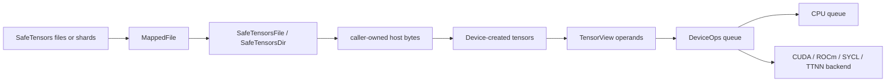

# IOM architecture

IOM is an inference-only C++20 engine for sparse, oversized language models. It
executes operations imperatively: there is no computation graph and no autograd
system. Callers create the storage and output tensors that an operation will
use, then submit work to a device queue. This keeps allocation, placement, and
lifetime decisions explicit—important when model weights can live across disk,
host RAM, and accelerator memory.

## System shape



The public API is split between backend-neutral headers in `include/iom` and
small backend factory headers in `include/iom/{cpu,cuda,rocm,sycl,ttnn}`.
`libiom` contains the neutral tensor, allocation, mapped-file, SafeTensors, and
CPU implementation. Each optional accelerator builds as a separate static
library and links to `libiom`:

| Backend | Build option and library | Runtime/storage model |
| --- | --- | --- |
| CPU | always in `libiom` | Reference device, caller-supplied storage, standard tiled encoding. |
| CUDA | `CUDA_ENABLED`, `iom_cuda` | One owned CUDA driver context per device; caller supplies unmanaged native device storage for that context. |
| ROCm | `ROCM_ENABLED`, `iom_rocm` | One owned HIP context per device; caller supplies native storage for that ordinal. |
| SYCL | `SYCL_ENABLED`, `iom_sycl` | One owned SYCL context for an eligible accelerator ordinal; caller supplies the allocator. |
| TTNN | `TTNN_ENABLED`, `iom_ttnn` | One owned TTNN device; TTNN owns native tensor storage, so no `iom::Allocator` is passed to its factory. |

Common code deliberately knows no runtime-specific type, active-backend global,
or backend-kind switch. A `Device` is a backend-neutral interface, and every
backend exports a factory returning `std::unique_ptr<Device>`. The concrete
device creates its tensors and its operation queues. Consequently, two devices
can coexist without a process-wide selection step.

### Layers and responsibilities

1. **Data and model ingestion.** `MappedFile` owns a read-only mapping.
   `SafeTensorsFile` parses one mapping, while `SafeTensorsDir` owns the shard
   files for a directory. Both return non-owning `SafeTensorView` objects over
   those mapped bytes.
2. **Core tensor contract.** `TensorSpec`, `Tensor`, and `TensorView` define
   logical shape, element encoding, quantization declaration, tiled layout, and
   view transformations. The core owns metadata only; actual storage belongs to
   the creating backend.
3. **Device and storage boundary.** `Device` validates the requested spec
   against backend capabilities and creates a materialized `Tensor`. CPU,
   CUDA, ROCm, and SYCL use the common standard layout; TTNN may use a native
   per-plane representation while maintaining the same public tensor contract.
4. **Execution boundary.** `DeviceOps` is an in-order asynchronous queue over
   caller-created views. `copy` is the required operation. Arithmetic methods
   are capability hooks: an unimplemented backend reports an error instead of
   silently falling back or allocating an output.
5. **Backend runtime implementation.** Backends turn a validated operation
   into synchronous host transfer, CPU work, or runtime stream submission. CUDA
   and ROCm share policy-templated queue, completion, staging, and copy
   machinery; their policy isolates driver/HIP primitives and diagnostics.

### Data flow and allocation policy

A typical weight path is:

1. Construct `SafeTensorsFile` or `SafeTensorsDir` for the model artifact.
2. Look up a named `SafeTensorView`; its raw bytes remain borrowed from the
   store's mapping.
3. Construct a backend device and create the destination `Tensor` from a
   validated `TensorSpec`.
4. Copy host bytes into the tensor view, or schedule a `DeviceOps::copy` between
   compatible device views.
5. Submit compute with explicit input and output views. Operations do not
   allocate operands or outputs; the caller owns their capacity and placement.
6. Wait for the returned operation token before consuming an asynchronous
   result, destroying an owner, or violating the host-transfer synchronization
   rules below.

This flow intentionally preserves a direct mapped-file -> SafeTensors ->
caller-created tensor -> queued-operation pipeline. IOM does not introduce a
central weight cache, active-device registry, or hidden output allocation.

## Tensor representation

### Specification and logical values

A `TensorSpec` contains:

- a `TensorShape`—an owned vector of logical dimensions;
- a leaf `DataType`, covering boolean, signed/unsigned 2- through 64-bit
  integers, several low-precision floating encodings, and F16/BF16/F32/F64;
- a `QuantizationFormat`, defaulting to `NONE` and enumerating generic,
  OCP, NVIDIA, GGML, and Tenstorrent formats.

`TensorShape` requires rank two or greater and nonzero dimensions.
`TensorShape::element_count`, `TensorSpec::logical_nbytes`,
`standard_padded_shape`, and `tiled_storage_nbytes` are checked size
calculations. `TensorSpec::validate()` is the gate before storage or work: it
rejects unknown leaf encodings and every quantization value other than the
currently implemented `NONE`, as well as invalid shapes and arithmetic
overflow. A device also exposes the exact unquantized leaf types it accepts
through `supported_data_types()`; `create_tensor` rejects unsupported
specifications rather than converting them.

The standard-layout backends—CPU, CUDA, ROCm, and SYCL—share one immutable set
of 23 unquantized leaf encodings. The `QuantizationFormat` enumeration reserves
the generic, OCP, NVIDIA, GGML, and Tenstorrent format names for future
implementations; it does not make them valid specifications today. TTNN has an
independent, narrower native capability table and rejects unsupported leaf
types before native allocation.

### Standard 16x16 tiled layout

The final two logical dimensions form a matrix and use fixed `16 x 16` tiles.
They are padded to tile boundaries for storage. Leading dimensions select matrix
planes and are row-major. The conceptual standard-layout order is:

```text
leading plane (row-major)
  -> tile row
    -> tile column
      -> row within 16x16 tile
        -> column within 16x16 tile
```

The exact standard slot helpers use checked coordinates and this order. This is
the physical layout used by CPU, CUDA, ROCm, and SYCL and is the common format
for their transfer/copy machinery. It is designed for tile-oriented matrix
hardware without making that runtime detail part of the public interface.

For standard-layout host transfers, logical elements are bit-packed
least-significant-bit first at the exact `DataType` width; multi-byte fields
are little-endian. The transfer implementation scatters that row-major logical
bit stream into tiles on upload and gathers it on download, leaving tile padding
outside the logical byte payload. Boolean host bytes are constrained to `0` or
`1`. TTNN is the storage exception: it maps each logical plane to a native
`32 x 32` tile internally, while exposing the same public logical shape and
view rules.

Metadata stays on the host. A tensor's native storage handle is owned by the
backend and may be host memory or device memory; callers must not infer the
layout from that opaque handle. Logical byte counts describe host transfer
payloads, whereas tiled storage counts include the standard layout's padding.

### Owners, views, and transforms

`Tensor` is the materialized owner produced only by `Device::create_tensor`.
It owns one stable full-storage `TensorView`; it is non-copyable and
non-movable. The creating `Device` must outlive it. A device's borrowed
allocator must likewise outlive that device and every tensor and queue created
from it. The base-address contract for allocator-backed tensors is 32-byte
alignment.

`TensorView` is a copyable, non-owning window into exactly one `Tensor` owner.
It contains a spec, a plane offset, and plane strides measured in **whole
logical planes**, never bytes or elements. It is deliberately not assignable:
a view cannot later be retargeted. Its `native_handle()` always denotes the
owner storage and is never a retained ownership handle.

Only leading dimensions are transformable:

- `slice(dim, first, count, step)` selects a strided leading range;
- `select(dim, index)` removes one leading dimension at an index;
- `permute(leading_order)` reorders leading dimensions;
- `reshape_leading(leading_dimensions)` changes only the leading logical shape.

The final two tiled dimensions cannot be sliced, selected, permuted, or
reshaped. Transformations preserve the same owner and must remain within its
logical plane address space; shape, rank, permutation, extent, and stride
arithmetic are validated before producing the new view. No transform relocates
storage.

### Transfer and lifetime rules

`TensorView::copy_from_host` and `copy_to_host` are synchronous transfers of
exactly `spec().logical_nbytes()`; a mismatched host buffer is invalid. They do
not wait for `DeviceOps` queues:

- wait for outstanding writes before reading the tensor from the host;
- wait for every outstanding read **and** write before overwriting it from the
  host or destroying its owner;
- retain all tensor owners until queued work using their storage has completed.
  Queues must snapshot any view metadata needed at submission: derived
  `TensorView` temporaries may be destroyed before `wait`.

Queue copies validate that both views belong to the queue's device and have the
same spec (shape, leaf type, and quantization). A copy whose windows are
identical is a valid no-op. Device identity, capability, shape, dtype,
quantization, buffer extent, and overflow are checked before the backend begins
work.

ADD validation produces an immutable backend-neutral snapshot of all three
views, including owner and device identities, handles, exact specifications,
offsets and strides, and the result-aligned logical broadcast mapping. Backend
queues consume that snapshot through the protected ADD hook. Once their
pre-acceptance resources and fence are ready, later CPU, GPU, SYCL, and TTNN
ADD implementations must use the protected `submit_add` seam with their
device-owned `RegistryState`; it reserves the sequence, registers each distinct
owner before the backend submission callback, and rolls registration back if
that callback
rejects the work. The queued outcome owns the copied snapshot and registration
until it releases or invalidates the entries at terminal completion. No backend
may retain the caller's `TensorView` objects.

## Public API guide

The library is intentionally small. The following are the user-facing entry
points; backend implementation classes and `iom::detail` helpers are not API.

| API | Function |
| --- | --- |
| `MappedFile(filename, min_size)` | Owns a file mapping. `data()` and `size()` expose borrowed read-only mapped bytes. |
| `SafeTensorsFile(filename)` | Opens a single SafeTensors artifact; `operator[]`, `size()`, and `keys()` retrieve non-owning named tensor views. |
| `SafeTensorsDir(dirname)` | Opens a sharded SafeTensors directory with the same store interface. |
| `SafeTensorView` | Carries source dtype, logical shape, byte count, and typed `raw<T>()` access to borrowed bytes. The originating store must outlive it and every raw pointer. |
| `TensorShape` | Owns dimensions and exposes rank, individual dimension, all dimensions, and checked element count. |
| `TensorSpec` | Describes a tensor's logical shape, leaf encoding, and quantization; derives padded shape and logical/tiled byte sizes and validates itself. |
| `Allocator` | Abstract caller-owned allocation policy: `alloc`, `free`, and `reset`. |
| `LinearAllocator` | One monotonic allocation region over caller-supplied memory. |
| `ListAllocator` | Reusable/coalescing allocation region with `free_bytes()`. |
| `FixedSizeAllocator` | Fixed-payload slot allocator with index, capacity, free-count, payload, and stride inspection. |
| `make_cpu_device(allocator)` | Creates the CPU reference device. |
| `make_cuda_device(ordinal, allocator)` | Creates a CUDA device for one backend-local ordinal. |
| `make_rocm_device(ordinal, allocator)` | Creates a ROCm device for one backend-local ordinal. |
| `make_sycl_device(ordinal, allocator)` | Creates a SYCL accelerator device for one eligible backend-local ordinal. |
| `make_ttnn_device(ordinal)` | Creates a TTNN device, whose native storage is owned by TTNN. |
| `ttnn_supported_data_types()` | Returns TTNN's immutable accepted unquantized leaf-type table. |
| `Device` | Reports `backend_kind`, accepted data types, and ordinal; creates `Tensor` owners and `DeviceOps` queues. |
| `Tensor::view()` | Returns the stable full-storage view. |
| `TensorView` | Inspects its spec/device/opaque handle and applies leading-dimension transforms or synchronous host transfers. |
| `DeviceOps` | Creates in-order asynchronous work with `copy`, `add`, `mul`, `silu`, `linear`, `rmsnorm`, and GQA `sdpa`; `wait(token)` observes completion. |
| `Block` | Minimal abstract inference block interface: `forward(const Tensor& x, Tensor& y)`. |
| `gpu_algorithm::compute_staging_size(logical_nbytes)` | Returns the logical transfer payload rounded to a 4-byte GPU word, rejecting rounding overflow. |

`DeviceOps::copy` is pure device-to-device work on compatible views. The
remaining compute entry points are public OID facades, but current hooks other
than the later ADD implementation remain `Unsupported`; this document does
not define ADD arithmetic or any future numeric capability.

### OID compatibility contract

`iom::oid` is signed `std::int64_t`. Negative values are terminal synchronous
results, with exactly these stable values: `OidError::InvalidArgument = -1`,
`Unsupported = -2`, `Overflow = -3`, `ResourceExhausted = -4`,
`DeviceError = -5`, and `InternalError = -6`. Positive values are accepted
asynchronous tokens; zero is invalid and is neither an error nor a token.
`to_oid(OidError) noexcept` returns the enum's negative underlying value,
`oid_is_error(oid) noexcept` classifies values by `value < 0`, and
`oid_is_token(oid) noexcept` classifies values by `value > 0`.

Every successful submission encodes queue ID `q` for the complete range
`1..255` in bits `55..62` and sequence `1..2^55-1` in the low 55 bits:
`static_cast<oid>((std::uint64_t{q} << 55) | sequence)`. Sequence zero is
never submitted. Exhaustion returns synchronous `Overflow` before effects or
acceptance, while invalid input, unavailable operations or specifications,
checked arithmetic, bounded-resource allocation, pre-acceptance runtime
failure, and otherwise unclassified failures map respectively to
`InvalidArgument`, `Unsupported`, `Overflow`, `ResourceExhausted`,
`DeviceError`, and `InternalError`. No synchronous exception crosses an OID
facade.

These facades validate, map, encode, and register lifetimes before backend
effects or token acceptance. Protected backend hooks cannot bypass that
common protocol. Accepted work is ordered and visible in submission order;
successful waits are repeatable, and post-acceptance failures are retained and
re-thrown by every later wait. Callers serialize calls on one queue.

`wait(token)` immediately throws `std::invalid_argument` for negative, zero,
foreign, future, skipped/reserved-but-never-submitted, or otherwise
unsubmitted values. A skipped value remains invalid after later completion.
Callers must consume negative results rather than expect synchronous exceptions,
and must wait only on accepted positive tokens; existing wait handling for
invalid tokens and retained asynchronous failures remains required.

## Backend execution machinery

### Queue model

`GpuQueue<Policy>` is the common CUDA/ROCm `DeviceOps` implementation. The
policy contains the runtime-specific context activation, stream, event, memory
copy, kernel launch, synchronization, and diagnostic operations; the queue
contains the lifecycle and correctness protocol. Each queue owns one runtime
stream, a worker, a metadata-slot pool, an event-ring state, and a queue-local
outstanding-work registration ID.

On `copy`, the queue first validates device/spec compatibility and serializes
submission ordering. It reserves a public token, stages a task, and the worker
submits it to the stream. A copy launch either embeds small metadata in the
kernel argument or obtains a metadata slot, copies the larger metadata to the
device, and launches the standard tiled grid-stride copy kernel. The stream
then records a completion event. After launch, the queue registers source and
destination storage in the outstanding-work registry with a fence tied to that
submission. That registry prevents unsafe transfer, reuse, or destruction
while work remains live.

The worker waits for each task's completion proof in queue order, removes or
invalidates the corresponding registry entries, releases associated resources,
and completes the public token. It preserves failures after work was enqueued:
if the normal event record fails, it attempts a fault-free record, then uses a
successful stream drain as the last completion proof. If no launch occurred,
the submission fails synchronously and no live-work registration is retained.
Queue destruction invalidates its registrations, drains the worker, synchronizes
and destroys its stream, then releases the shared state.

`StagedWorker` is the backend-neutral worker primitive used by the GPU queue.
It first executes the staging/launch callback, publishes the task only after
that succeeds, and processes published tasks in submission order. Its worker
thread waits for a task fence, destroys the fence, and reports the completion.
Shutdown drains staged and published work without waiting again on work already
being torn down, so completion tokens remain observable.

### Event ring

`EventRingState` lazily creates and pools up to 16 runtime events. Acquiring a
submission reserves one event and blocks if all pooled events are still in use.
The event is not reused merely when the worker has observed completion: the
submission record is retained by the outstanding-work fence, so it stays
reserved until every registry entry and destruction snapshot referencing it is
gone. This prevents a later submission from overwriting the completion state an
earlier fence must still observe.

A `Submission` starts pending. The worker marks it successful only after it has
synchronized a recorded event, or after the exceptional path has proved
completion by draining the stream. Synchronization failure becomes a retained
failure. Metadata attached to the submission is released during cleanup; the
event itself returns to the ring only when the submission record's last shared
reference is destroyed.

### Metadata-slot pool

Large view/copy descriptors do not become unbounded per-copy allocations.
`MetadataSlotPool` owns 16 host/device metadata slot pairs. A submission
acquires a slot only after the previous submission using that slot has retired,
so resizing its host and device storage cannot race unrelated stream work. The
slot grows only when required, exposes host and device pointers to the queue,
and is released with the submission cleanup. Small descriptors bypass this pool
and are passed inline to the kernel.

### Staging pool and transfer-stream pool

Host transfers use a separate resource path from queued device copies.
CUDA/ROCm standard-layout transfers combine a `TransferStreamPool` with a
`StagingSlotPool`:

- `TransferStreamPool` leases an idle runtime transfer stream or creates one
  when the idle pool is empty. Its scope synchronizes before returning a
  healthy stream; a poisoned stream or failed synchronization destroys it
  instead of recycling it. Destruction closes the pool, waits for active
  scopes, then destroys the idle streams.
- `StagingSlotPool` leases reusable device staging storage. It creates or grows
  slots on demand, caps an individual staging request at 8 GiB and the pool at
  16 slots, blocks when every slot is busy, and remembers poisoned leases so
  failed storage is not reused. Releasing a lease returns it to the free set or
  destroys the poisoned allocation.

The staging payload is the logical byte count padded to a 4-byte kernel word;
overflow in that rounding is an error. Transfers are synchronous from the
caller's perspective: the implementation stages the logical data, performs the
runtime copies/kernel work on its leased stream, synchronizes it, then returns
both leases. The pools amortize runtime allocation/stream creation without
changing the `TensorView` synchronous-transfer contract.

### SYCL queue and staging

SYCL implements the same public queue semantics without `GpuQueue<Policy>`.
The device owns an in-order transfer queue, a 16-slot staging pool, and the
outstanding-work registry. Its operation queue combines `StagedWorker` with a
16-slot metadata pool and a `SyclFenceState`. Each fence owns an optional
`sycl::event`, a retained post-launch failure, and a cached result; it invokes
`wait_and_throw` once, then makes that same success or failure repeatably
available to registry and queue completion.

Unlike CUDA/ROCm's inline-small-metadata path, the SYCL queue uses a metadata
slot for every launched copy, enqueues host-to-device metadata transfer and a
tiled `parallel_for`, and retains the resulting event. Its worker completes
the event, releases or invalidates registry entries, and releases metadata.
The SYCL staging pool mirrors the CUDA/ROCm bounds—16 slots and an 8 GiB
request limit—but each slot has device and host USM allocations. Synchronous
uploads and downloads use that pair, waiting for queue work before reusing it;
a failed transfer poisons and vacates the slot.

### TTNN queue and retained host staging

TTNN does not use the CUDA/ROCm event ring, metadata pool, or transfer-stream
pool. A TTNN tensor is a vector of native tiled tensors, one per logical
plane. Its operation queue registers ownership before native submission and
uses a fence that locks the device API mutex and finishes the TTNN mesh queue.
The worker coalesces contiguous completed submissions so it can finish one
batch and report outcomes in sequence order. Failed fences invalidate
outstanding-work entries; owner destruction releases storage only when the
registry says it is safe, otherwise it quarantines the native planes until a
finish proves that cleanup is safe.

TTNN host transfers are synchronous but use `TtnnHostStaging` retained by the
device. It keeps upload slots by supported native dtype and plane plus a
download byte buffer. After warm-up, same-or-smaller transfers reuse host
staging; larger transfers grow retained buffers once. The API mutex serializes
access. When completion cannot be proved, the affected upload/download slot is
retired rather than reused; retired storage is reclaimed only after a covering
successful finish, or at device teardown.

SYCL and TTNN preserve the public `Device`, `Tensor`, view, and operation queue
contracts but do not share CUDA/ROCm's `GpuQueue`, event ring, or
transfer-stream pool implementation.

## Invariants checklist

- A `Device` and its supplied allocator outlive every tensor and queue they
  create; owners are non-copyable and non-movable.
- A view is a non-owning, copyable but non-assignable window into one owner;
  never retain its native handle beyond that owner.
- The last two dimensions are always `16 x 16` tiled. Only leading dimensions
  may be viewed or reshaped.
- Storage is never relocated by a view, transform, transfer, or operation.
- Operations allocate no input or output tensors. Callers provide all tensors
  and host buffers.
- Host access is explicitly synchronized with outstanding queue work.
- Queues are in-order and tokens are repeatably waitable; completed failures
  remain observable.
- Backends validate compatibility and capability before executing; unsupported
  work reports an error rather than falling back to another backend.
